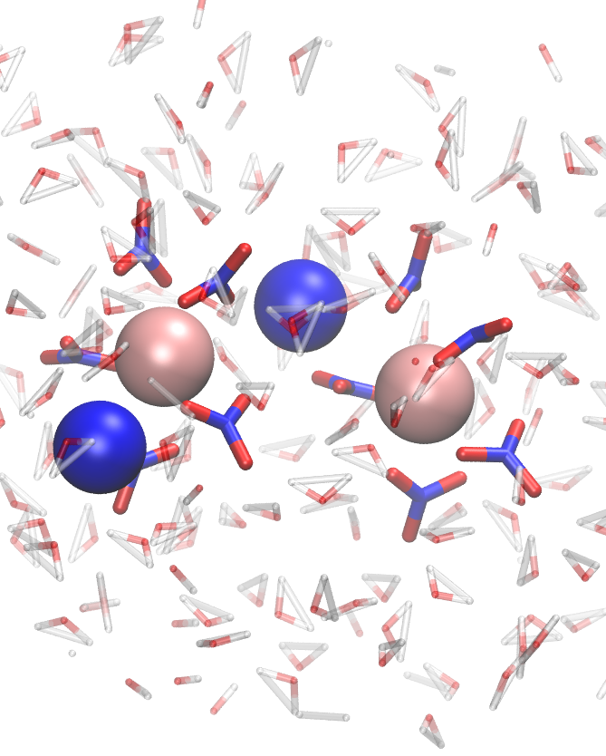

# Oligomerisation of Thorium complexes with different electrolytes.

This repo provides analysis of QMMM simulations investigating the oligerisation behaviour of Thorium(IV)-NO3 complexes with varying electrolyte composition (K+/Li+/Na+) in conjunction with my former employer HZDR (Department of the chemistry of the f-elements).

## Context

In this case we have three systems 

## Setup

QMMM simulations were run for 200 ps using CHARMm/Turbomole for MM and QM regions respectively. The exact set-up is largely in line with a 5-part explanation I provided on my blog;
* [1: basics](https://ahtheelementofsurprise.wordpress.com/2020/05/10/qmmm-with-charmm-turbomole-part-i-the-very-basics/)
* [2: setting up CHARMm](https://ahtheelementofsurprise.wordpress.com/2020/05/10/qmmm-with-charmm-turbomole-part-ii-the-charmm-side/) 
* [3: setting up Turbomole](https://ahtheelementofsurprise.wordpress.com/2020/05/10/qmmm-with-charmm-turbomole-part-iv-the-stuff-ive-found-that-works/) 
* [4: putting it all together](https://ahtheelementofsurprise.wordpress.com/2020/05/10/qmmm-with-charmm-turbomole-part-iv-stuff-ive-found-that-works/) 
* [5: general tips](https://ahtheelementofsurprise.wordpress.com/2020/05/17/qmmm-with-charmm-turbomole-part-iv-general-tips-and-stuff-ive-found-that-works/)