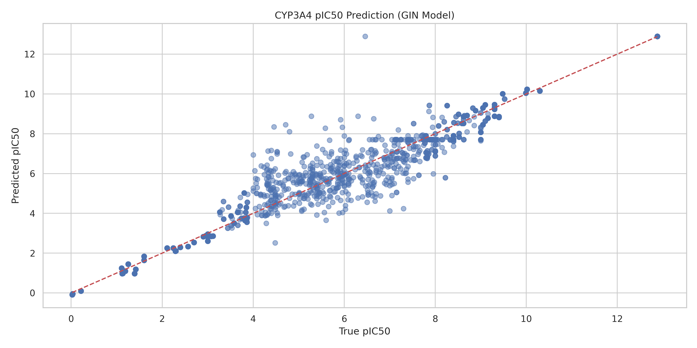
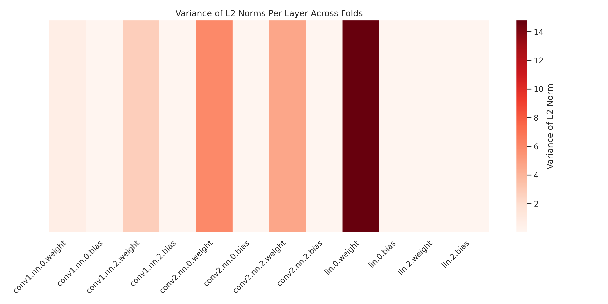
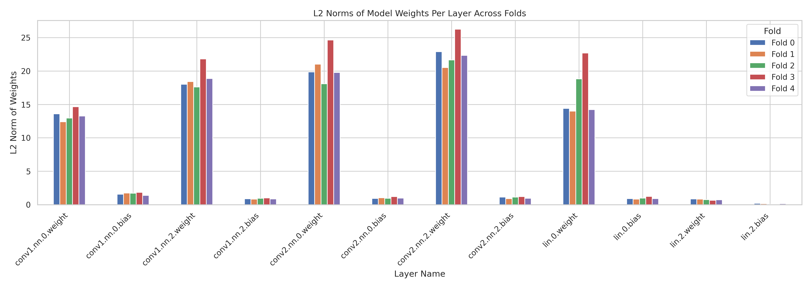

# DL model to predict CYP3A4 activity. 

In this repo we have a model trained on Chembl data to predict the pIC50 of molecules against the CYP3A4 isoform from SMILES.  

In this case we have a lighter DL regression model (GINRegressor) that gets very good performance with the following features implemented to improve training and prediction:

* Simple descriptors such as atom symbols and hybridisation type (one-hot encoded) augmented with Rdkit chemical descriptors which should contribute to lipophilicity (partial charges, aromaticity, vdW radius, etc.). 
* Two linear MLP layers and two convolutional layers.
* A final output layer for the regression (`self.lin`)
* Train / test/ validation splits for training.
* Hyperparameter tuning via grid search with early stopping.
* Evaluation via error statistics (RMSE, MAE and R²).

The code and details of the model featurisation, specification, training and evaluation can be found in `2025-08-28_ml_cyp_3a4.ipynb`. The trained model file is `cyp_3a4_gin.pt` and can be used in any Python workflow.

Training data was retrieved via the Chembl `webresource_client` API, which is pip installable. The retrieved data from Chembl is in `data_cup_3a4/cyp_3a4_chembl.csv` and is comprised of **6081 data points**. See `2025-08-26_retrieve_chembl_cyp_3a4.ipynb` for code and further details re: post-processing clean-up of the data.

## Model metrics

```
RMSE: 0.6664
MAE: 0.4216
R²: 0.9629
```



The data were suspiciously nice so I had a deeper look at whether there was any model over-fitting. 

Both curves decrease rapidly in the first ~10 epochs, showing good learning. After that, both training and validation losses continue to decrease more slowly and the validation loss closely tracks the training loss - indicative of good generalisation and minimal overfitting. Classically, overfitting would be indicated by a difference in curve behaviour (training loss decreasing while validation loss increases / plateaus, a widening gap between the two curves over epochs, etc)


X-fold validation showed variance in the lin0.weight across folds and one fold (Fold 3) was conspicuously more accurate than others in this and most metrics, when we'd hope they are similar.




`lin.0` is the first linear layer after global pooling, which means it's likely the first point of aggregation between node-level and global-level features. However, the values of all the other folds are very similar so, on balance, there's unlikely to be much of a generalisability issue.

```
Fold 0 - lin.0.weight L2 norm: 14.3973
Fold 1 - lin.0.weight L2 norm: 14.0053
Fold 2 - lin.0.weight L2 norm: 18.8263
Fold 3 - lin.0.weight L2 norm: 22.7037
Fold 4 - lin.0.weight L2 norm: 14.2238
```

See `2025-08-28_ml_cyp_3a4.ipynb` for all the training code and analysis used to generate these data.  

## Next steps

* A detailed post at [my blog](https://ahtheelementofsurprise.wordpress.com/comp-chem-blog/) will step through the model code, construction and training. 
* Experiment with lighter models - maybe we can get similar performance with much faster methods.