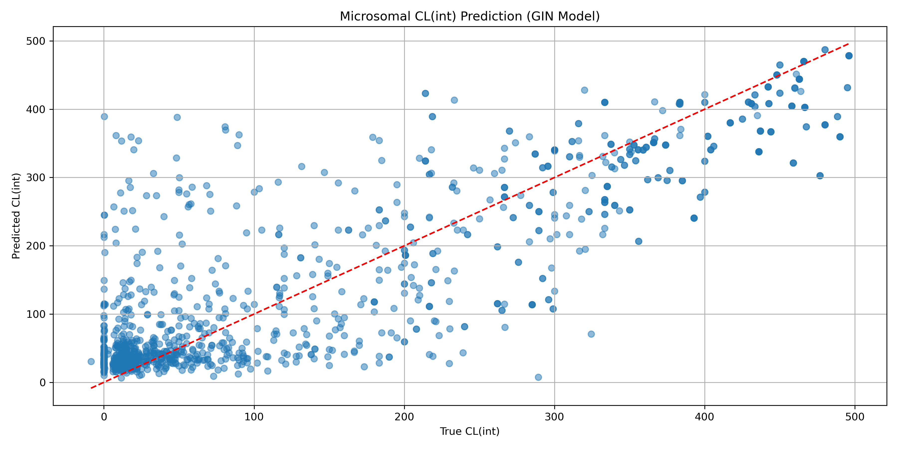

# Transfer learning from a GIN DL model to predict intrinsic clearance in human hepatocytes. 

In this repo we have a model trained on Chembl data to predict the in vivo intrinsic clearance in human hepatocytes from SMILES. Because there's a lot more data on Chembl for microsomal Clint, a DL model was initially trained on that data (~ 15K data points) and then the hep data (~ 1000 data points) was added as a refinement.

The code and details of the model featurisation, specification, training and evaluation can be found in `2025-08-28_retrieve_chembl_microsomal_clint.ipynb`. The trained model file is `hep_clint_gin.pt` and can be used in any Python workflow.

Training data was retrieved via the Chembl `webresource_client` API, which is pip installable. The retrieved data from Chembl is in `data_logd/*.csv` and is comprised of **~60K data points**. As most of it was unlabelled, species (human, rat, mouse, dog, etc.) and cell types (microsomes, heps, etc.) were inferred from `assay_description` and other columns. See `2025-10-12_retrieve_chembl_hep_clint.ipynb` for code and further details re: post-processing clean-up of the data.

## Model metrics

```
RMSE: 81.9572
MAE: 56.4748
R²: 0.7168
```



This is actually a reasonable result for microsomal clint. These data are notoriously noisy due to varying conditions, measurements, etc. An important factor is the gender of the species cells were extracted from. Although there is some info in the output, it's not reliable enough to use, sadly. 

**After transfer learning**.

```
RMSE: 47.5916 | MAE: 27.5201 | R²: 0.8955
```

We expect a performance bump with transfer learning but this was suspiciously good.

**Training with random seeds in train/val split**.

```
RMSE: 52.3262 | MAE: 31.6308 | R²: 0.8995
RMSE: 44.6918 | MAE: 25.6284 | R²: 0.9246
RMSE: 32.5187 | MAE: 21.2618 | R²: 0.9633
```

We expect a performance bump with transfer learning but this was suspiciously good. Aside from the above check and making sure train/val sets had low leakage, scaffold similarity, etc. the performance holds. I still don't buy it and in production maybe you'd dig deeper but this will do for now. 

## Next steps

* A detailed post at [my blog](https://ahtheelementofsurprise.wordpress.com/comp-chem-blog/) will step through the model code, construction and training. 
* Performance comparison vs other pre-trained LogD predictors. Spot checks of predictions suggest improved performance when compared to Cxcalc.