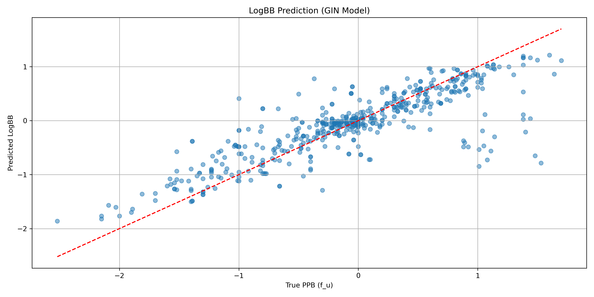
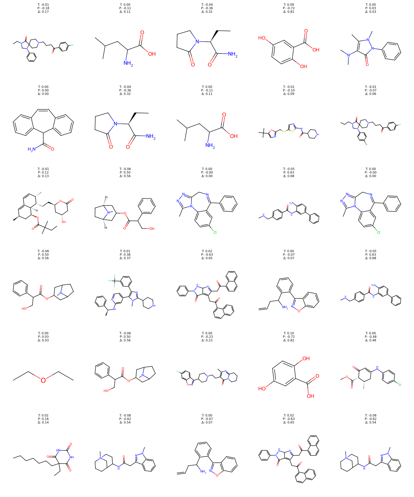

# DL model to predict LogBB (brain permeability). 

In this repo we have a model trained on Chembl data to predict brain permeability (LogBB) from SMILES.  

The code and details of the model featurisation, specification, training and evaluation can be found in `2025-09-21_ml_caco2.ipynb`. The trained model file is `caco2_abpapp_gin.pt` and can be used in any Python workflow. Specs have only a few minor alterations when compared to the other ADME models in this repo.

Not much of this data is on Chembl so I had to manually extract it from the biggest sources I could find

- [Zhu et al, 2015](https://link.springer.com/article/10.1007/s11095-015-1687-1#Sec14) (supp info) - 438 data points.
- [B3DB](https://github.com/theochem/B3DB) - 7800 data points (only ~1000 have numerical data; the rest are classified as -LogBB/+LogBB).
- [Shaker at al, 2023](https://academic.oup.com/bioinformatics/article/39/10/btad577/7274862?login=false) - 1000 data points

= total of **2497** data points.

Retrieved data is in `data_log_bb/*.csv`. See `2025-10-11_retrieve_chembl_log_bb.ipynb` for code and further details re: post-processing clean-up of the data.

## Model metrics

```
RMSE: 0.4279
MAE: 0.2759
R²: 0.6925
```



Overall correlation is okay (~ 0.7), which is a little better than what's published generally. Not many data points but this gives probably as good a model as one could expect with public sources.



Generally not many outliers and the predictions aren't bad. Still, the occasional big swing and a miss. Haven't looked into this in detail yet.

See `2025-10-11_ml_log_bb.ipynb` for all the training code and analysis used to generate these data.  

## Next steps

* A detailed post at [my blog](https://ahtheelementofsurprise.wordpress.com/comp-chem-blog/) will step through the model code, construction and training. 
* Experiment with lighter models - maybe we can get similar performance with much faster methods.