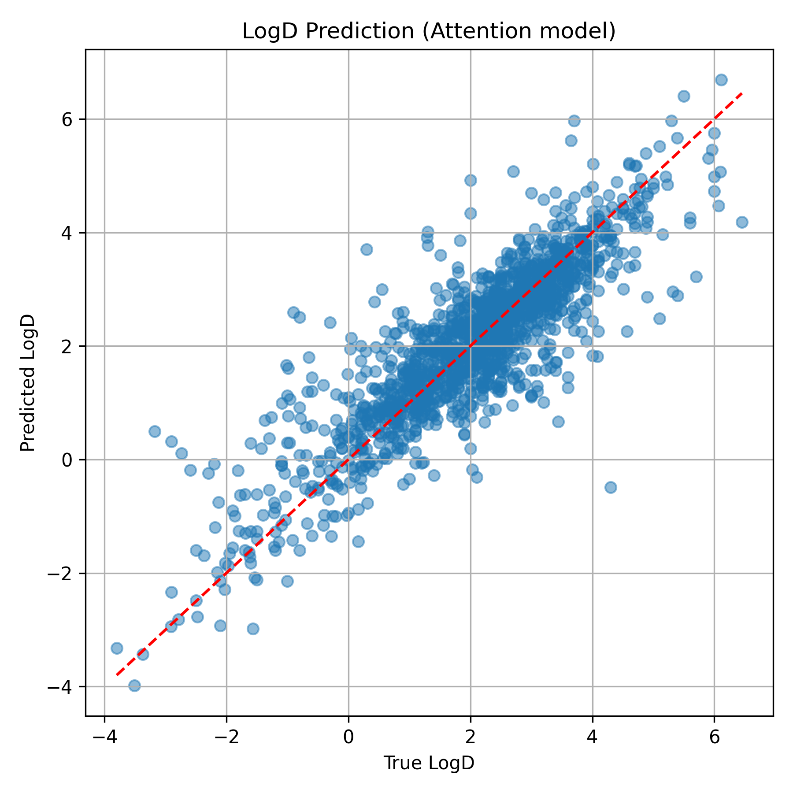

# Transformer model to predict LogD 

In this repo we have a model trained on Chembl data to predict the LogD from SMILES.  

The LogD model is a multi-head Graph Attention Transformer (GATv2Conv) regression model with the following features implemented to improve training and prediction:

* Simple descriptors such as atom symbols and hybridisation type (one-hot encoded) augmented with Rdkit chemical descriptors which should contribute to lipophilicity (partial charges, aromaticity, vdW radius, etc.). 
* Two GATv2Conv layers; a multi-head attention layer and a single-head attention layer.
* A final output layer for the regression (`self.lin`)
* Train / test/ validation splits for training.
* Hyperparameter tuning via grid search with early stopping.
* Evaluation via error statistics (RMSE, MAE and R²).

The code and details of the model featurisation, specification, training and evaluation can be found in `2025-08-26_ml_logd.ipynb`. The trained model file is `logd_gat.pt` and can be used in any Python workflow.

Training data was retrieved via the Chembl `webresource_client` API, which is pip installable. The retrieved data from Chembl is in `data_logd/logd_chembl.csv` and is comprised of **7713 data points**. See `2025-08-26_retrieve_chembl_logd.ipynb` for code and further details re: post-processing clean-up of the data.

## Model metrics

RMSE: 0.7615
MAE: 0.5425
R²: 0.7450

## Next steps

* A detailed post at [my blog](https://ahtheelementofsurprise.wordpress.com/comp-chem-blog/) will step through the model code, construction and training. 
* Performance comparison vs other pre-trained LogD predictors. Spot checks of predictions suggest improved performance when compared to Cxcalc.