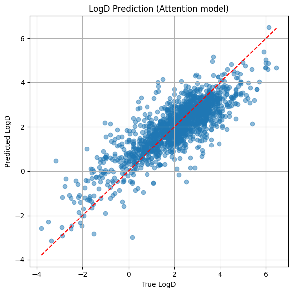

# TRansformer model to predict LogD 

In this repo we have a model trained on Chembl data to predict the LogD from SMILES.  

The LogD model itself is a Graph Convolutional Network (GCN) deeping learning classifier (0=inactive, 1=active @ 10 uM) with the following features implemented to improve training and prediction:

* Random balanced sampling of the Chembl data.
* Simple atom and bond features (one-hot encoded).
* Two sets of linear MLP layers and two convolutional layers with mean aggregation and a linear output layer.
* Train / test/ validation splits for training.
* Hyperparameter tuning via grid search with early stopping.
* Evaluation via ROC and confusion matrix.

The code and details of the model featurisation, specification, training and evaluation can be found in `2025-08-26_retrieve_chembl_logd.ipynb`. 

Training data was retrieved via the Chembl `webresource_client` API, which is pip installable. The retrieved data from Chembl is in `data_herg/herg_chembl.csv` and is comprised of **6365 data points**. See `2025-08-08_retrieve_chembl_herg.ipynb` for code and further details re: post-processing clean-up of the data.

## Model metrics

|    precision | recall | f1-score | support |      |
|-------------:|--------|----------|---------|------|
| Negative     | 0.92   | 0.59     | 0.72    | 1000 |
| Positive     | 0.70   | 0.95     | 0.80    | 1000 |
| accuracy     |        |          | 0.77    | 2000 |
| macro avg    | 0.81   | 0.77     | 0.76    | 2000 |
| weighted avg | 0.81   | 0.77     | 0.76    | 2000 |

The trained model file is `herg_gnn.pt` and can be used in any Python workflow.

## Next steps

* A detailed post at [my blog](https://ahtheelementofsurprise.wordpress.com/comp-chem-blog/) will step through the model code, construction and training. 
* Performance comparison vs other pre-trained hERG predictors.