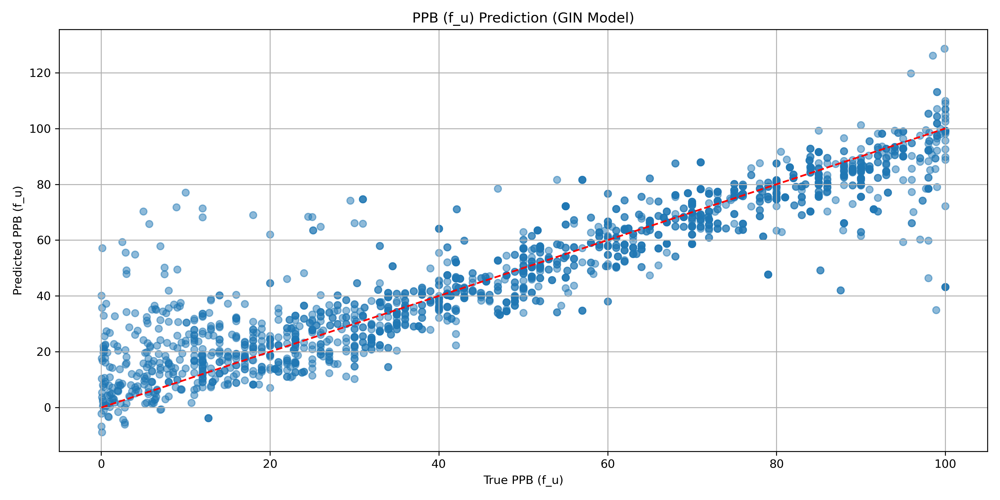

# DL model to predict human PPB fraction unbound (%). 

In this repo we have a model trained on Chembl data to predict the fraction unbound (f_u) from plasma protein binding (human). 

The code and details of the model featurisation, specification, training and evaluation can be found in `2025-10-08_ml_ppb_f_ub.ipynb`.  The trained model file is `ppb_f_u_gin.pt` and can be used in any Python workflow.

Training data was retrieved via the Chembl `webresource_client` API, which is pip installable. The retrieved data from Chembl is in `data_ppb_f_u/ppb_f_u_chembl.csv` and is comprised of **4377 data points**. 

Had to use quite a few keyword tricks to find the right data and also had to use some multiprocessing to avoid angering the Chembl REST gods. 

Chembl has plenty of non-human data (rat and mouse) but is inconsistent with labelling the species and readouts/units. These had to be inferred from the `assay_description` to get all the relevant readouts (% f_u). Given the amount of rat data (more than human), this is probably a decent test case for some transfer learning or MTL if the model peformance wasn't decent. See `2025-10-08_retrieve_chembl_ppb_f_u.ipynb` for code and further details re: post-processing clean-up of the data.

## Model metrics

```
RMSE: 11.5067
MAE: 7.5827
R²: 0.8439
```



Overall good correlation and good (~0.85) performance, some scatter at low unbound fraction (< 10% f_u), which is annoying but not fatal.

There's some evidence of model over training in the L2 norms, especially in layers that would be more affected by larger molecules. Also the outliers are very poorly predicted.

Will look into this in more detail in time but for now, the model performs well. 


See `2025-10-08_ml_ppb_f_u.ipynb` for all the training code and analysis used to generate these data.  

## Next steps

* A detailed post at [my blog](https://ahtheelementofsurprise.wordpress.com/comp-chem-blog/) will step through the model code, construction and training. 
* Experiment with lighter models - maybe we can get similar performance with much faster methods.